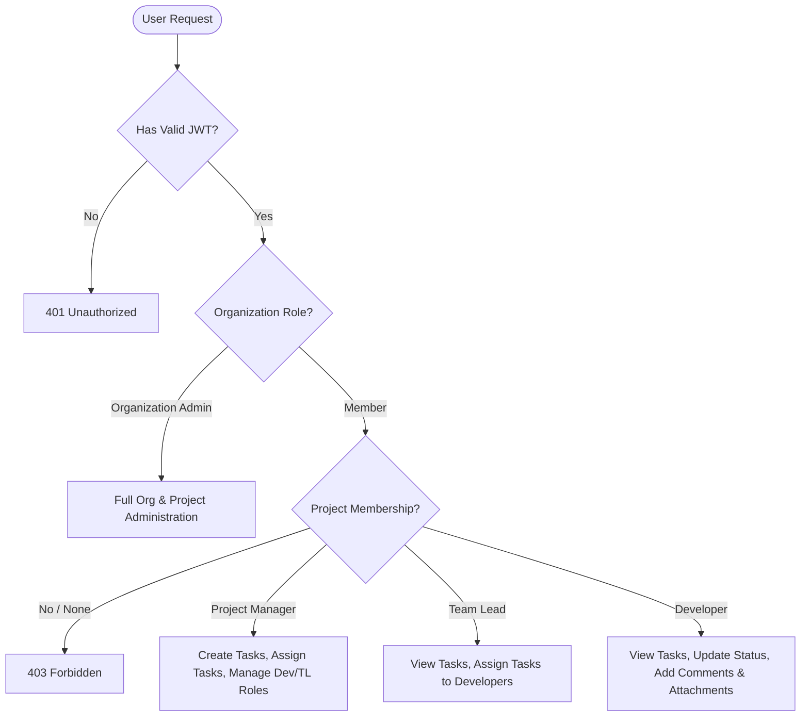

# System Architecture & Technical Design

## 1. High-Level Architecture Overview

The **SNEC Task Management System (FlowTask)** is built as a modern, decoupled client-server web application adhering to clean architecture, layered abstractions, and strict Role-Based Access Control (RBAC).

```mermaid
graph TD
    subgraph Client Tier [Frontend - Next.js 16 (Turbopack, TailwindCSS, Zustand)]
        UI[Responsive Modern UI / Glassmorphism]
        AuthStore[Zustand Auth & Session Store]
        ApiClient[Axios Client with Bearer Interceptor]
    end

    subgraph API Gateway / Application Tier [Backend - NestJS 10 Framework]
        Guard[Auth & Roles Guards (JWT/RBAC)]
        Controllers[REST Controllers]
        Services[Business Logic & Domain Services]
        Logger[Winston Structured Logger]
    end

    subgraph External Services
        Cloudinary[Cloudinary Media & Attachment CDN]
        SMTP[Nodemailer Email & OTP Gateway]
    end

    subgraph Persistence Tier [PostgreSQL & Prisma ORM]
        Prisma[Prisma ORM Client]
        NeonDB[(PostgreSQL Database / Neon)]
    end

    UI --> AuthStore
    UI --> ApiClient
    ApiClient -->|REST API over HTTP/JSON| Guard
    Guard --> Controllers
    Controllers --> Services
    Services --> Logger
    Services --> Cloudinary
    Services --> SMTP
    Services --> Prisma
    Prisma --> NeonDB
```

---

## 2. Multi-Tier Breakdown

### 2.1 Presentation Layer (Frontend)
- **Framework**: Next.js 16.3.2 with React 19 and Turbopack.
- **Routing**: Next.js App Router with Route Grouping (`(auth)`, `(dashboard)`, `(admin)`, `organization`).
- **State Management**: Zustand with persistent storage for session tokens (`accessToken`, `refreshToken`, user context).
- **Styling**: TailwindCSS 4, dynamic CSS micro-animations, glassmorphism, responsive sidebar and dashboard architecture.
- **Form Controls**: Reusable `AppInput`, `AppSelect`, and `AppDatePicker` ensuring consistent light/dark theme compliance and calendar picking.

### 2.2 Application Layer (Backend)
- **Framework**: NestJS (TypeScript) with Modular Structure (`AuthModule`, `UsersModule`, `OrganizationsModule`, `ProjectsModule`, `TasksModule`, `CloudinaryModule`, `EmailModule`, `DatabaseModule`, `AuditLogsModule`, `AdminModule`).
- **Authentication**: Stateless JSON Web Tokens (Access Token + Refresh Token), Google OAuth 2.0 Integration via Passport.
- **Authorization**: Custom NestJS Guards (`JwtAuthGuard`, `RolesGuard`, `PermissionsGuard`) enforcing both organization and project-level scopes.
- **File Uploads**: Multer memory storage stream piped to Cloudinary for zero-disk serverless-compatible attachment handling.

### 2.3 Data Layer (Persistence)
- **Database**: PostgreSQL (hosted on Neon with connection pooling).
- **ORM**: Prisma ORM with automated migrations, client generation, and relation cascade handling.

---

## 3. Security & Access Control Architecture

### 3.1 Dual-Level RBAC Matrix



---

## 4. Key Workflows

### 4.1 Organization Registration & Authentication
1. **Registration**: User enters company details and email. Backend generates a 6-digit OTP stored with a 5-minute expiry in the `Otp` table. Nodemailer sends an HTML-formatted OTP. Upon OTP submission, an atomic Prisma transaction creates both the `Organization` entity and the initial `Organization Admin` user account.
2. **Password Recovery**: Users can request a password reset OTP which is emailed via Nodemailer. Using this OTP, users can securely set a new password.
3. **Google OAuth**: Users can bypass email registration and login/register seamlessly via Google. Usernames are auto-generated from email prefixes.

### 4.2 Project & Task Lifecycle
1. **Creation**: Organization Admin or Project Manager creates a project and picks members from the organization roster.
2. **Assignment**: Tasks are assigned with estimated hours, priority, and deadline.
3. **Execution**: Developers update status in real-time on the drag-and-drop Kanban board (`TODO` → `IN_PROGRESS` → `IN_REVIEW` → `DONE`).
4. **Collaboration**: Members post real-time task comments and upload technical specifications or screenshots directly to Cloudinary.

### 4.3 Auditing & Reporting
1. **Audit Logs**: All critical CRUD and Auth operations (Login, Logout, Create Task, Update Project, etc.) are recorded persistently in the `AuditLog` table.
2. **Reports Engine**: Real-time aggregation of project progress, user productivity, task completion rates, and overdue task warnings for Organization Admins.

### 4.4 Super Admin Management
1. **Tenant Oversight**: Super Admins can list, update, and completely remove organizations from the database, effectively managing the SaaS ecosystem globally.

### 4.5 API Documentation (Swagger)
1. **Swagger UI**: The backend is integrated with `@nestjs/swagger` which automatically generates OpenApi definitions from controllers and DTOs.
2. **Access**: When running locally, the API docs can be accessed at `http://localhost:5000/api/docs`. It provides an interactive interface for exploring all available endpoints, their expected payloads, and authentication requirements.
