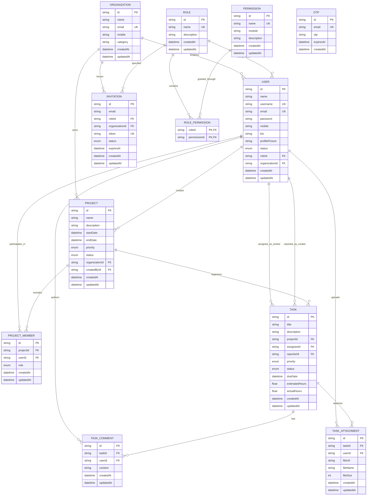

# Entity-Relationship (ER) Diagram & Database Schema

## 1. Database Entity-Relationship Diagram

---

## 2. Schema Dictionary

### 2.1 Enums

| Enum Name | Values |
|---|---|
| `UserStatus` | `ACTIVE`, `INACTIVE` |
| `InvitationStatus` | `PENDING`, `ACCEPTED`, `REJECTED` |
| `ProjectRole` | `PROJECT_MANAGER`, `TEAM_LEAD`, `DEVELOPER` |
| `ProjectPriority` | `LOW`, `MEDIUM`, `HIGH` |
| `ProjectStatus` | `PLANNING`, `ACTIVE`, `ON_HOLD`, `COMPLETED` |
| `TaskPriority` | `LOW`, `MEDIUM`, `HIGH`, `URGENT` |
| `TaskStatus` | `TODO`, `IN_PROGRESS`, `IN_REVIEW`, `DONE` |

---

## 3. Key Relationships & Cascades

- **`Project` → `ProjectMember`**: `onDelete: Cascade` (Deleting a project removes its member assignments).
- **`Project` → `Task`**: `onDelete: Cascade` (Deleting a project removes associated tasks).
- **`Task` → `TaskComment`**: `onDelete: Cascade` (Deleting a task removes comments).
- **`Task` → `TaskAttachment`**: `onDelete: Cascade` (Deleting a task removes attachment records).
- **`Task` → `Assignee (User)`**: `onDelete: SetNull` (Deleting a user leaves task unassigned without deleting task history).
